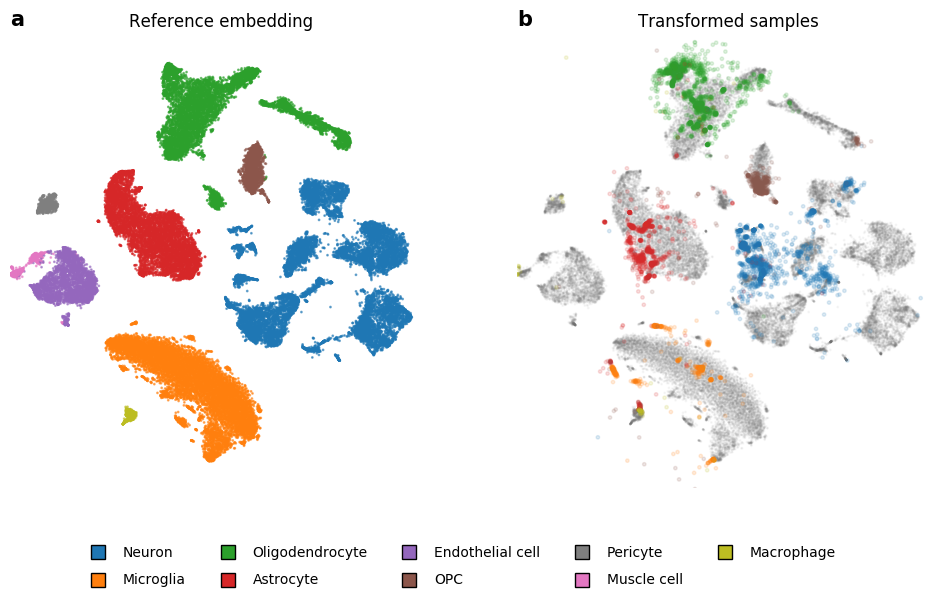

# Embedding to Reference t-SNE Space Addresses Batch Effects in Single-Cell Classification



## Data

All data used in the notebooks and figures are available at http://file.biolab.si/tsne-embedding/.

## Citation
```raw
@article {Policar2021,
  author = {Poli{\v{c}}ar, Pavlin G. and Stra{\v{z}}ar, Martin and Zupan, Bla{\v{z}}},
  title = {Embedding to Reference t-SNE Space Addresses Batch Effects in Single-Cell Classification},
  journal = {Machine Learning},
  pages = {1--20},
  year = {2021},
  publisher = {Springer},
  doi = {10.1007/s10994-021-06043-1}
}
```
