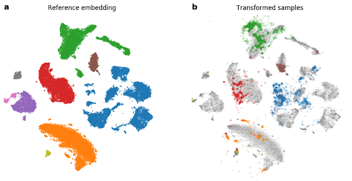

# Embedding to Reference t-SNE Space Addresses Batch Effects in Single-Cell Classification



## Data

All data used in the notebooks and figures are available at http://file.biolab.si/tsne-embedding/.

## Citation
```raw
@article {Policar671404,
  author = {Policar, Pavlin G. and Strazar, Martin and Zupan, Blaz},
  title = {Embedding to Reference t-SNE Space Addresses Batch Effects in Single-Cell Classification},
  elocation-id = {671404},
  year = {2019},
  doi = {10.1101/671404},
  publisher = {Cold Spring Harbor Laboratory},
  URL = {https://www.biorxiv.org/content/early/2019/06/14/671404},
  eprint = {https://www.biorxiv.org/content/early/2019/06/14/671404.full.pdf},
  journal = {bioRxiv}
}
```
